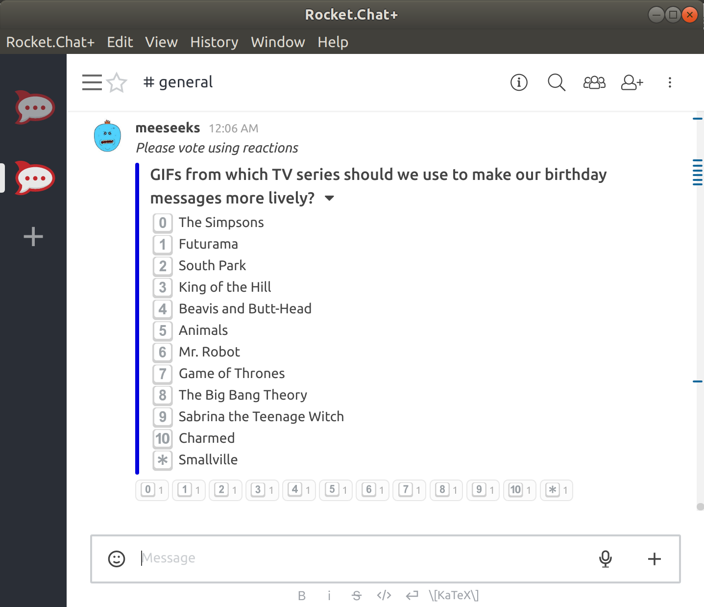

[](https://travis-ci.org/tolstoyevsky/hubot-vote-or-die)

# hubot-vote-or-die

Hubot script for building polls for your [Rocket.Chat](https://rocket.chat) users.

The name of the script was inspired by the song «[Vote or Die!](http://southpark.wikia.com/wiki/Vote_or_Die!)» from the South Park episode «[Douche and Turd](https://en.wikipedia.org/wiki/Douche_and_Turd)».

<p align="center">
    
</p>

## Features

* Emojis-based.
* The bot prepares in advance all the necessary emojis (`:zero:`, `:one:`, `:two:`, etc), putting them under the polls to simplify searching for them to vote.
* Up to 12 possible options.
* It's possible to build polls sending private messages to the bot. It helps to make a kind of preview of the future polls (note that to use this feature `RESPOND_TO_DM` must be set to `true`).

## Installation

In hubot project repo, run:

`npm install git+https://github.com/tolstoyevsky/hubot-vote-or-die --save`

Then add **hubot-vote-or-die** to your `external-scripts.json`:

```json
[
  "hubot-vote-or-die"
]
```

## Authors

See [AUTHORS](AUTHORS.md).

## Licensing

hubot-vote-or-die is available under the [Apache License, Version 2.0](LICENSE).

